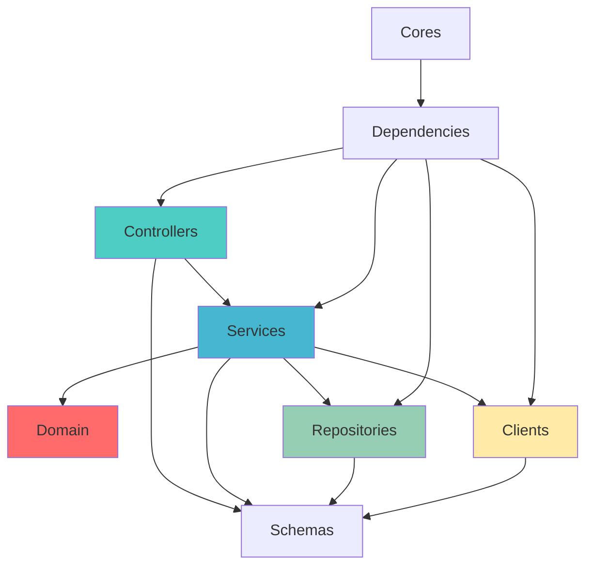

# Blueprint 專案架構說明

## 📋 專案概述

Blueprint 是一個基於 **Clean Architecture（整潔架構）** 設計的 Python 專案模板，旨在提供一個可擴展、可維護、可測試的應用程式架構基礎。專案採用分層設計原則，確保關注點分離和依賴倒置。

## 🏗️ 架構設計原則

### Clean Architecture 核心概念
- **依賴倒置**：內層不依賴外層，依賴關係指向內部
- **關注點分離**：每一層都有明確的職責範圍
- **可測試性**：業務邏輯與外部依賴解耦，便於單元測試
- **可擴展性**：新功能可以在不影響核心邏輯的情況下添加

### 分層架構圖
```
┌─────────────────────────────────────────────────────────────┐
│                      Controllers Layer                      │
│                        (API 接口層)                         |
├─────────────────────────────────────────────────────────────┤
│                       Services Layer                        │
│                        (應用服務層)                          │
├─────────────────────────────────────────────────────────────┤
│                      Domain Layer                           │
│                     (核心業務邏輯層)                         │
├─────────────────────────────────────────────────────────────┤
│      Repositories Layer      │        Clients Layer         │
│         (資料存取層)            │         (外部服務層)        │
└─────────────────────────────────────────────────────────────┘
│                       Schemas Layer                         │
│                        (資料模型層)                          │
├─────────────────────────────────────────────────────────────┤
│    Dependencies Layer        │          Cores Layer         │
│        (依賴注入層)           │          (核心配置層)         │
└─────────────────────────────────────────────────────────────┘
```

## 📁 資料夾結構與職責

### 🌐 `clients/` - 外部服務客戶端層
**職責**：
- 封裝對外部 API 的調用
- 處理外部服務的協議轉換
- 提供斷路器、重試等容錯機制

**範例實作**：
```python
# clients/email_client.py
import httpx
from abc import ABC, abstractmethod

class EmailClient(ABC):
    @abstractmethod
    async def send_welcome_email(self, email: str) -> bool:
        pass

class SendGridEmailClient(EmailClient):
    def __init__(self, api_key: str):
        self.api_key = api_key
        self.client = httpx.AsyncClient()
    
    async def send_welcome_email(self, email: str) -> bool:
        # SendGrid API 調用實作
        pass
```

### 📋 `schemas/` - 資料模型層
**職責**：
- 定義 API 輸入輸出的資料結構
- 提供資料驗證和序列化
- 作為不同層次間的資料傳輸物件

**範例實作**：
```python
# schemas/user_schema.py
from pydantic import BaseModel, EmailStr
from datetime import datetime
from typing import Optional

class UserCreateSchema(BaseModel):
    username: str
    email: EmailStr
    
    class Config:
        json_encoders = {
            datetime: lambda v: v.isoformat()
        }

class UserResponseSchema(BaseModel):
    id: int
    username: str
    email: str
    created_at: datetime
    is_active: bool
```

### 🔗 `dependencies/` - 依賴注入層
**職責**：
- 管理物件的生命周期和依賴關係
- 提供 IoC 容器功能
- 支持不同環境的配置切換

**範例實作**：
```python
# dependencies/container.py
from dependency_injector import containers, providers
from repositories.user_repository import UserRepository
from repositories.impl.sqlalchemy_user_repository import SqlAlchemyUserRepository
from services.user_service import UserService

class Container(containers.DeclarativeContainer):
    config = providers.Configuration()
    
    # Database
    database = providers.Singleton(
        Database,
        connection_string=config.database.connection_string
    )
    
    # Repositories
    user_repository = providers.Factory(
        SqlAlchemyUserRepository,
        session=database.provided.session
    )
    
    # Services
    user_service = providers.Factory(
        UserService,
        user_repo=user_repository
    )
```

### ⚙️ `cores/` - 核心配置層
**職責**：
- 管理應用程式配置
- 提供環境變數處理
- 定義核心常數和枚舉

**目前實作**：
```python
# cores/config.py
from pydantic_settings import BaseSettings

class Config(BaseSettings):
    """Config class for the application settings."""
    app_name: str = "Sample Application"
    debug: bool = False
    # connection string for the database
    host: str = "localhost"
    port: int = 5432
    username: str = "user"
    password: str = "password"
    database: str = "sample"
```

## 🔄 依賴流向圖



## 🛠️ 技術棧

### 當前技術選型
- **Python**: 3.9+
- **配置管理**: Pydantic Settings
- **專案管理**: pyproject.toml

### 建議技術擴展
- **Web 框架**: FastAPI
- **ORM**: SQLAlchemy + Alembic
- **資料驗證**: Pydantic
- **依賴注入**: Dependency Injector
- **測試框架**: pytest + pytest-asyncio
- **資料庫**: PostgreSQL
- **快取**: Redis
- **監控**: Prometheus + Grafana
- **日誌**: structlog
- **API 文件**: Swagger (FastAPI 內建)

## 🚀 實施指南

### 開發順序建議
1. **完善配置層** (`cores/`)
2. **實現資料模型** (`schemas/`)
3. **定義領域實體** (`domain/`)
4. **實現資料存取** (`repositories/`)
5. **建立應用服務** (`services/`)
6. **實現外部客戶端** (`clients/`)
7. **配置依賴注入** (`dependencies/`)
8. **實現 API 控制器** (`controllers/`)
9. **整合主程式** (`main.py`)

### 測試策略
```
測試金字塔：
    E2E Tests (少量)
      ↑
  Integration Tests (適量)
      ↑
  Unit Tests (大量)
```

- **單元測試**: 專注於 Domain 層的業務邏輯
- **整合測試**: 測試 Services 與 Repositories 的整合
- **端到端測試**: 測試完整的 API 流程

### 最佳實踐

#### SOLID 原則應用
- **S**: 每個類別都有單一職責
- **O**: 通過介面擴展功能，不修改現有程式碼
- **L**: 衍生類別可以替換基類
- **I**: 介面隔離，避免胖介面
- **D**: 依賴抽象而非具體實作

#### 錯誤處理策略
```python
# domain/exceptions.py
class DomainException(Exception):
    """領域層異常基類"""
    pass

class UserNotFoundException(DomainException):
    """使用者不存在異常"""
    pass

# controllers/error_handlers.py
@app.exception_handler(DomainException)
async def domain_exception_handler(request, exc):
    return JSONResponse(
        status_code=400,
        content={"detail": str(exc)}
    )
```

## 📈 擴展性考慮

### 微服務演進
當應用程式成長到一定規模時，可以按領域將此架構拆分為多個微服務：
- 每個微服務保持相同的分層架構
- 通過 API Gateway 統一對外接口
- 使用事件驅動架構處理服務間通訊

### 效能優化
- **快取策略**: 在 Services 層實現快取
- **資料庫優化**: 在 Repositories 層實現查詢優化
- **非同步處理**: 使用 asyncio 和 Celery
- **負載均衡**: 水平擴展 Controllers 層

## 🔍 監控和運維

### 可觀測性
- **日誌**: 結構化日誌記錄
- **指標**: 業務和技術指標收集
- **追蹤**: 分散式追蹤實現

### 部署策略
- **容器化**: 使用 Docker
- **編排**: Kubernetes 或 Docker Compose  
- **CI/CD**: GitHub Actions 或 GitLab CI
- **環境管理**: 開發、測試、生產環境隔離

## 📚 參考資料

- [Clean Architecture by Robert C. Martin](https://blog.cleancoder.com/uncle-bob/2012/08/13/the-clean-architecture.html)
- [Domain-Driven Design by Eric Evans](https://domainlanguage.com/ddd/)
- [FastAPI Documentation](https://fastapi.tiangolo.com/)
- [Dependency Injector Documentation](https://python-dependency-injector.ets-labs.org/)

---

此架構設計旨在提供一个可擴展、可維護的 Python 應用程式基礎，遵循 Clean Architecture 原則，確保程式碼的可測試性和可讀性。隨著專案的發展，可以根據實際需求調整和擴展各個層次的實現。